# PkView 

(build 0.31)

Viewer for 3D and 4D functional data and Pharmacokinetic modelling

## Disclaimer and acknowledgments
Please acknowledge this software in any publication or other work that uses analysis, results or figures generated by this software and cite the related publiction. The new related publication is: **Irving et al (2017) maskSLIC: Regional Superpixel Generation with Application to Local Pathology Characterisation in Medical Images. [https://arxiv.org/abs/1606.09518v2](https://arxiv.org/abs/1606.09518v2)**. This publication highlights the PK modelling and latest clustering methods used in PKView. 

**This software has been developed for research purposes only, and should not be 
used as a diagnostic tool. The authors or distributors will not be responsible for 
any direct, indirect, special, incidental, or consequential damages arising of the use of this software.The current intention of this software is for "in house" use only and shouldn't be distributed without the explicit consent of the authors.**

## Installation

Executables are available for Ubuntu, Windows and OSx. 

For OSx one dependency is not yet ready for high definition screens which leads to poorer resolution. 

## Basic Usage

#### Load 4D volume

PKView loads images, rois and overlays from nifti files. 

Either: 

1) Drag and drop a 4D nifti file onto the viewer

or

2) File -> Load Image

When dragging and dropping, a window will pop up to specify whether the image is a 4D volume, ROI or overlay. 

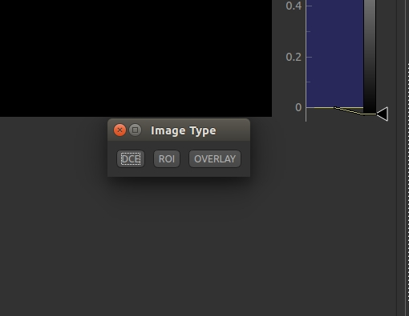

The image will appear in the 3 views. 
Options
- Zoom using the **right mouse button**
- **Left mouse button** click a point
- **scroll** using the mouse wheel
- Options allow scaling based on the voxel size

#### Load ROI and overlays

Drag-and-drop or load overlays in a similar way.

For overlays specify the overlay type or a generic type (as show below)

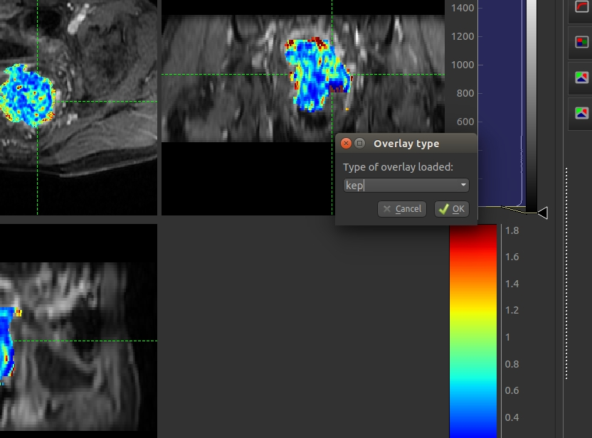

Switch between loaded or generated overlays from the *current overlays* section of the **Volumes** widget. 

## General interaction

- Scroll mouse button to navigate through the volume
- Left click on a point to navigate through the volume
- Use the sliders at the bottom to navigate through the volume
- Double click on a window to expand (see below)

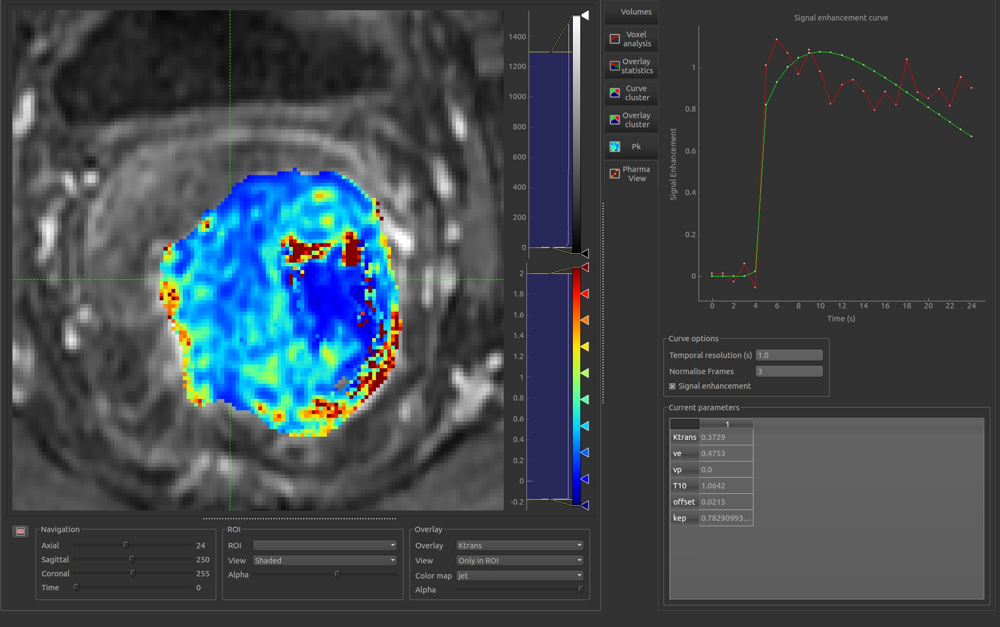

## Volume, ROI and overlay interaction

## Voxel analysis widget

- The voxel analysis widget gives the enhancement curve of the currently selected location. 

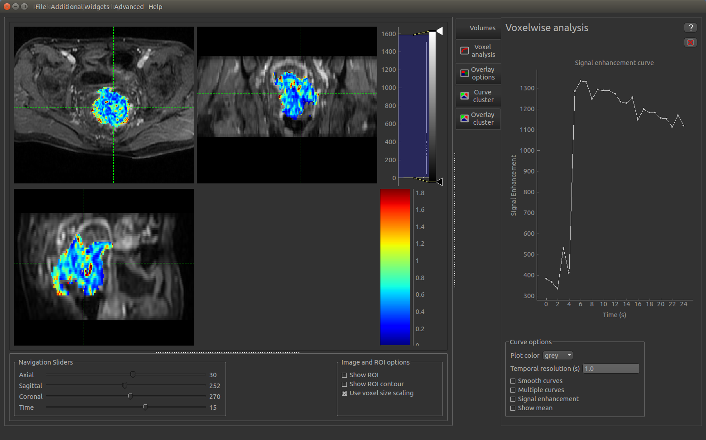

- Multiple points can be selected with multiple colors
- Mean curves for each color can be calculated
- Points can be cleared with X
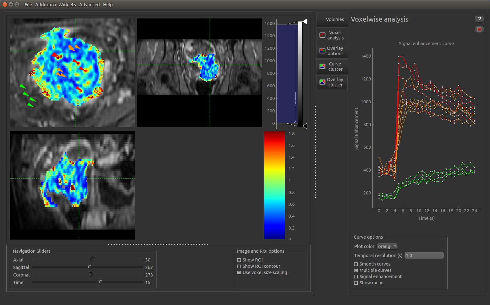

## Saving images

#### Save a screen shot or plot
- Right click on an image or plot
- Click *Export*
- A view box will appear with the various format options. 
- *svg* format will allow editing of the layers and nodes in inkscape or another vector graphics viewer. 

#### Save an overlay to nifti

File -> Save Current overlay

## Overlay statistics widget

- Statistics for each defined ROI
- Mean, Median, Variance, Min and Max

## Curve clustering widget

- PCA based curve clustering allows clustering of tumour subregions based on contrast enhancement characteristics. 
- Number of clusters
- PCA modes used for clustering
- Advanced options: Merge clusters, auto merge clusters, get cluster sizes

## Overlay clustering widget

- Cluster based on a particular ROI map
- Step 1: Select the overlay of interest

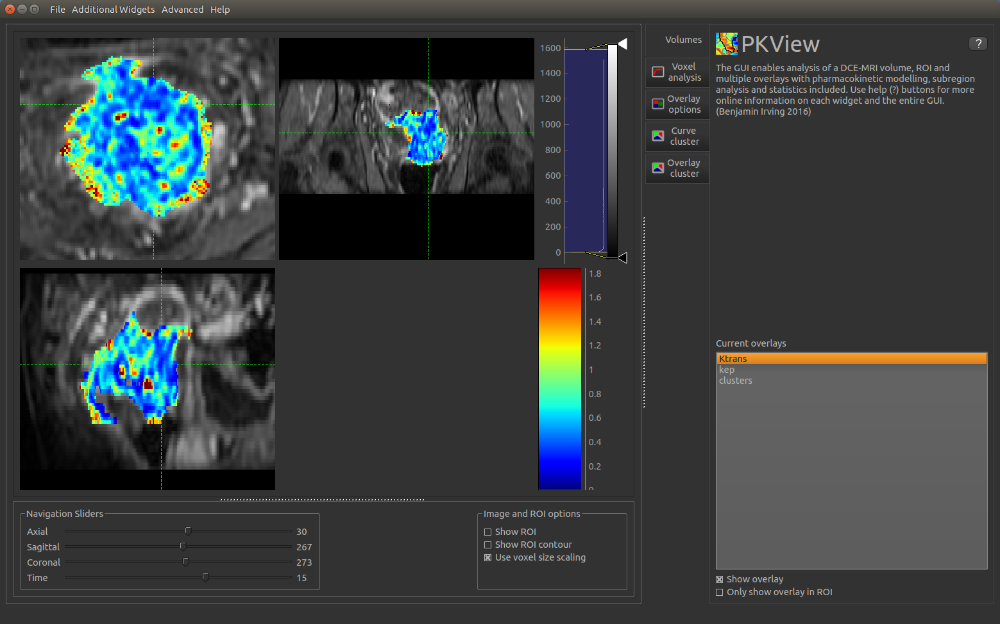

- Step 2: Cluster based on the selected ROI. 
- Get slice and volume statistics

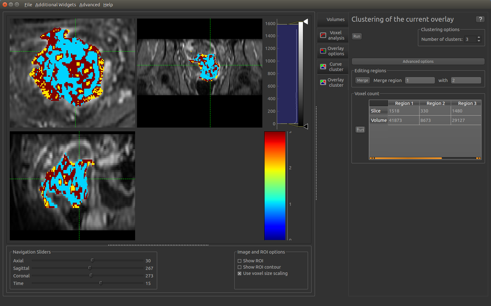

## Supervoxel widget
Create supervoxel regions within an ROI (see https://arxiv.org/abs/1606.09518v2)

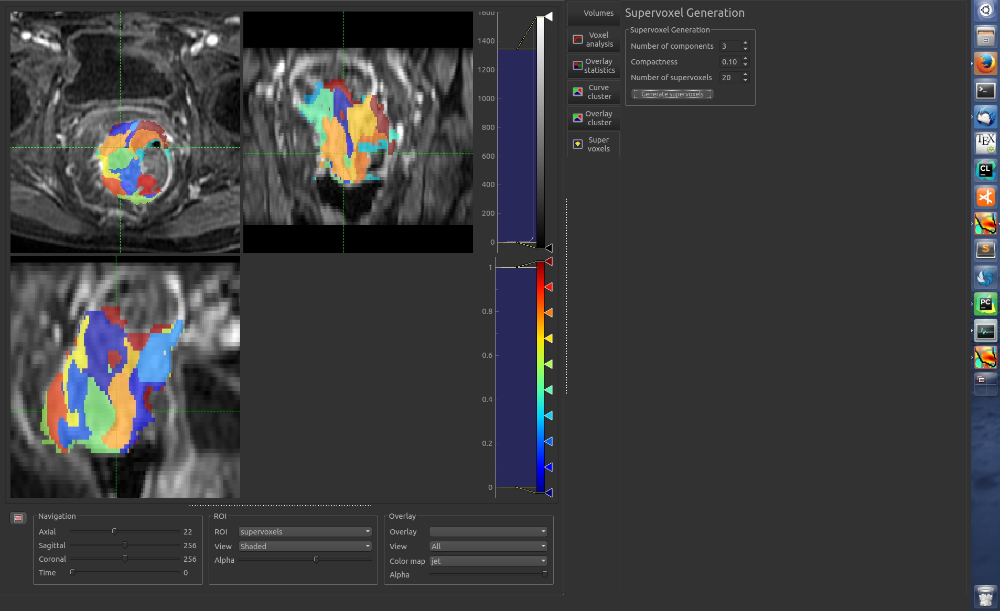

## Mean value widget
Generate mean values from the current overlays for each ROI. 

*Example showing mean Ktrans value of each supervoxel*

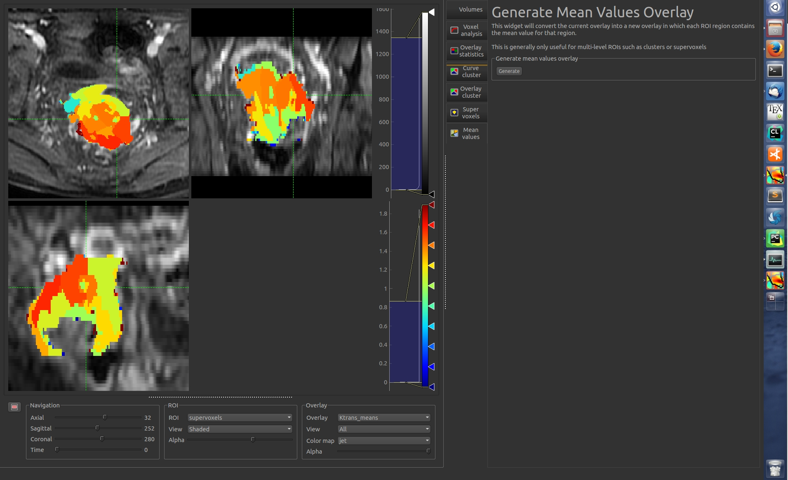

## T1 mapping widget
Generate T1 maps from variable flip angle images (used as a preprocessing step for PK modelling)

*Using a single 4D volume with multiple flip angles*
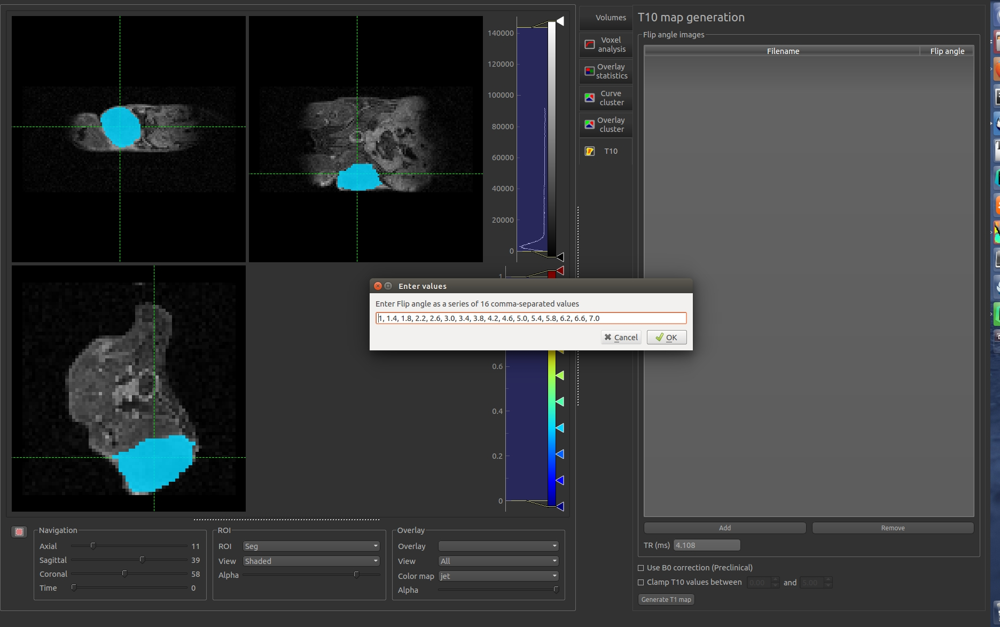

*Loading muliple flip angle volumes*
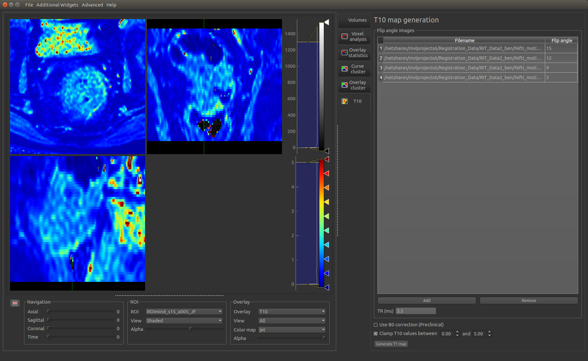

## PK modelling widget

- Load DCE-MRI, ROI and T10 map
- Select pharamacokinetic model
- Input image parameters
- Run modelling inside the ROI

*Start of modelling*
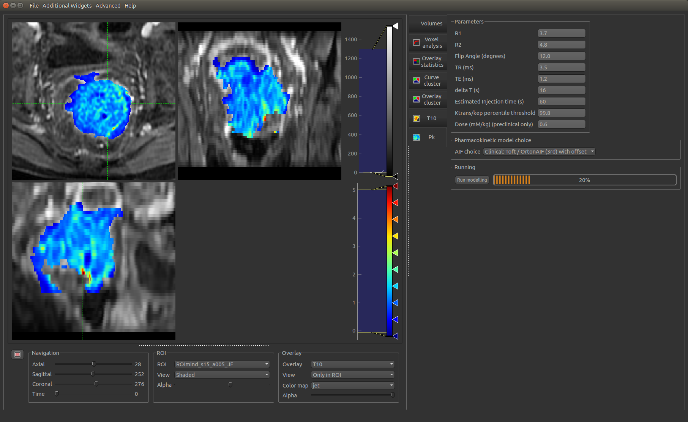

*Modelling complete with newly generated Ktrans map*
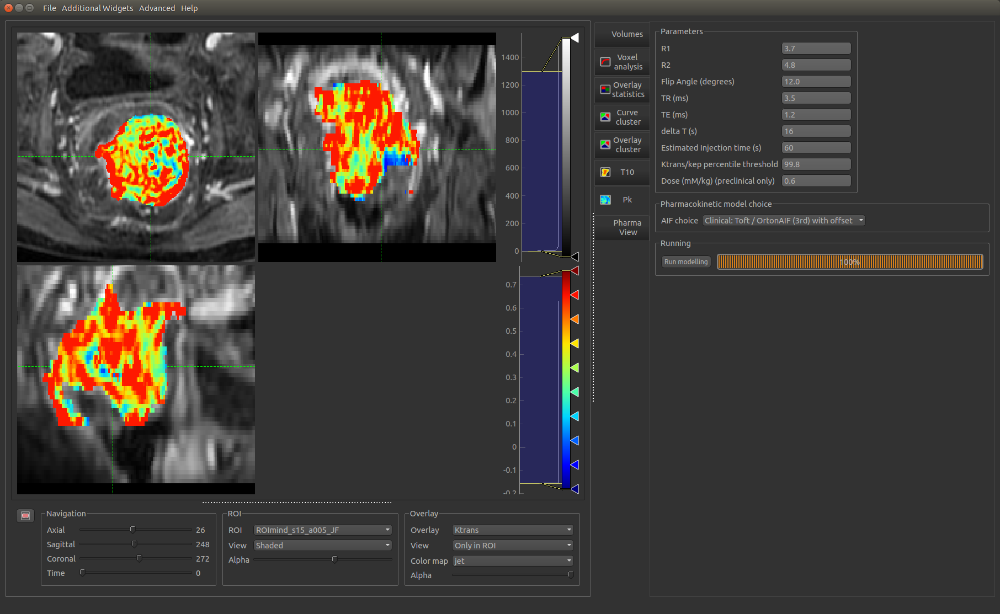

*Still required:*
- Inclusion of Contrast-to-noise ratio restriction

## Visualisation of model fit widget
- *Additional Widgets -> PharmCurveView*
- If Pk modelling has been run or *model curves* are loaded from a nifti file then visualise the difference in parameters between the model fit and the true data. 

Images copyright 2016, 2017 Benjamin Irving

