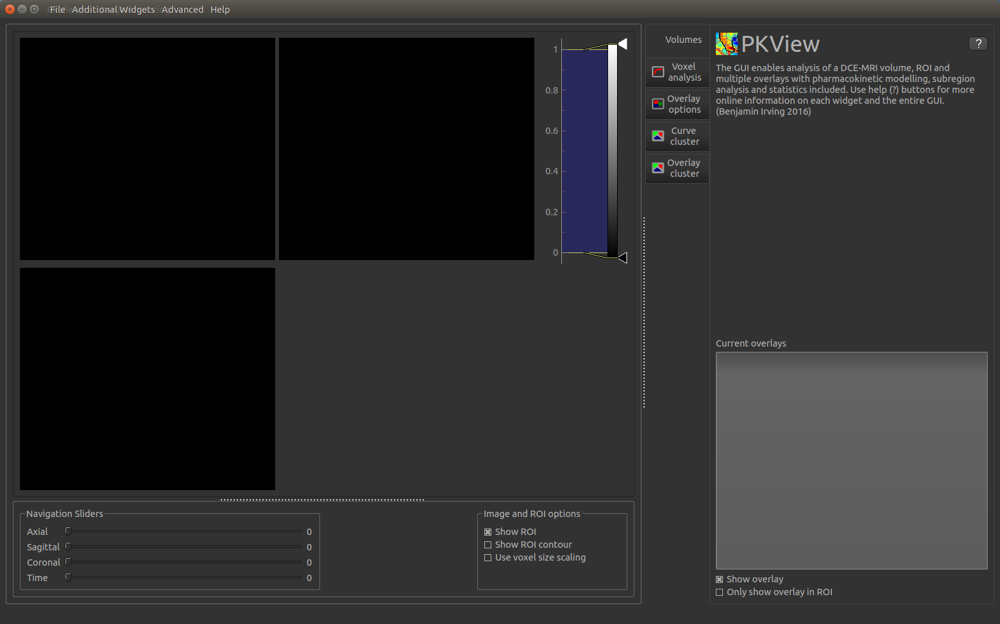
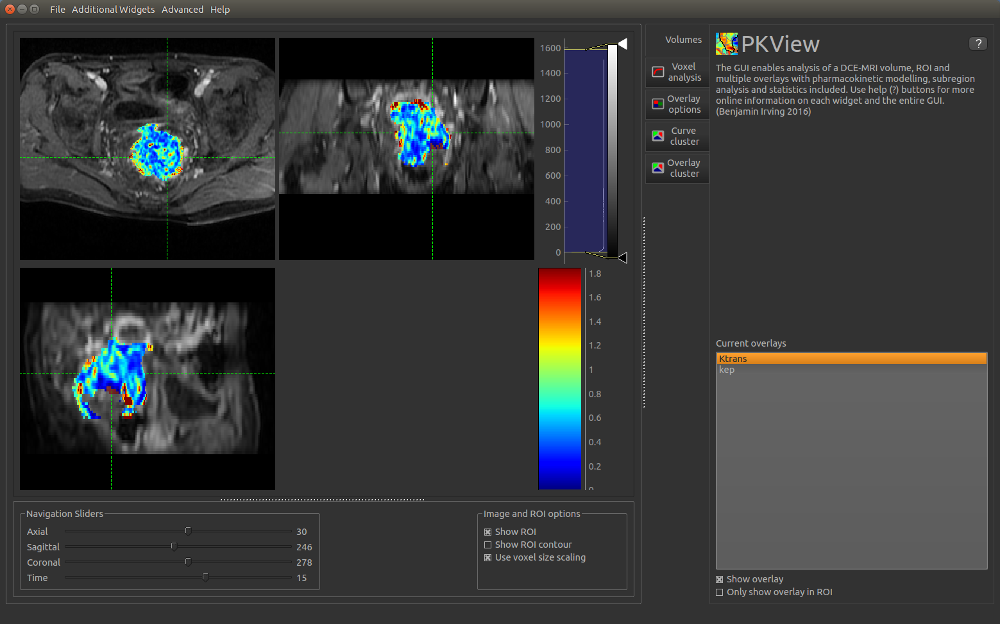
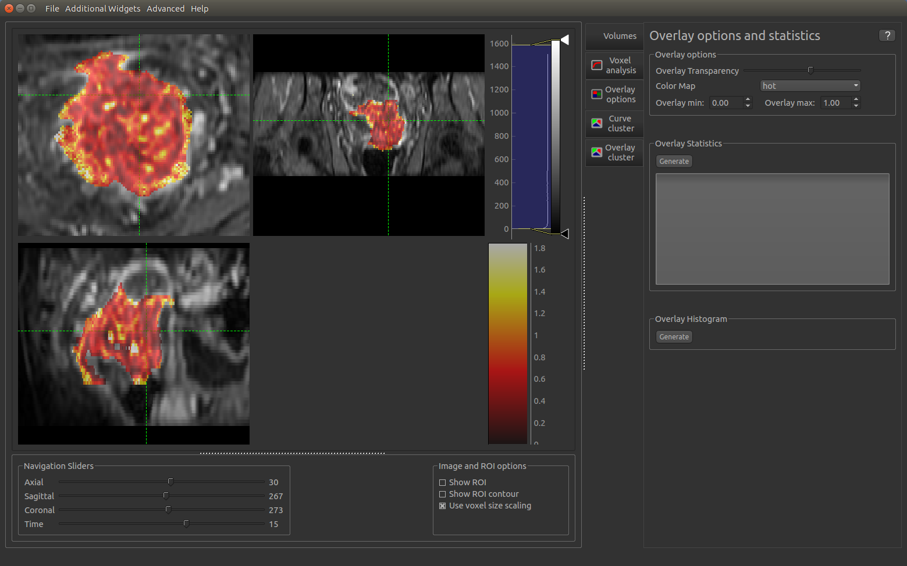
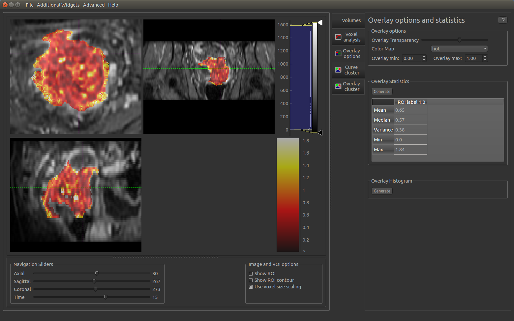
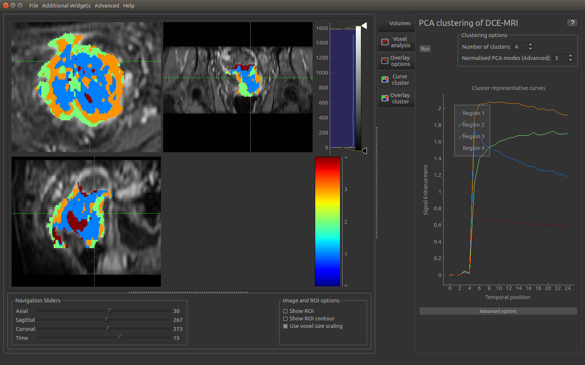
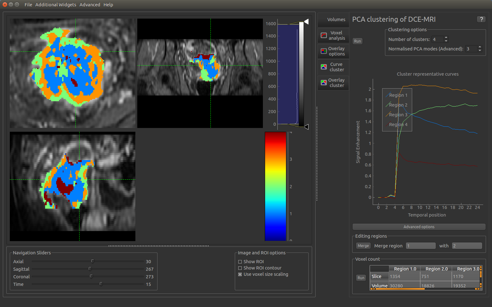
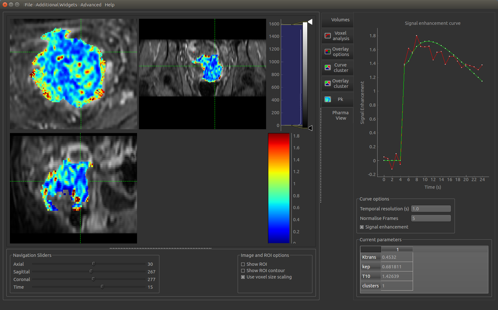
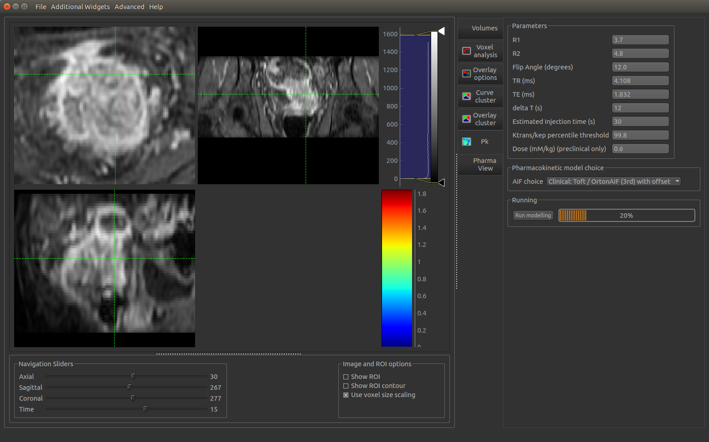

PkView
======

Viewer for 3D/4D data and Pk modelling

Disclaimer:
This software has been developed for research purposes only, and should not be 
used as a diagnostic tool. In no event shall the authors or distributors be liable to 
any direct, indirect, special, incidental, or consequential damages arising of the use 
of this software, its documentation, or any derivatives thereof, even if the authors 
have been advised of the possibility of such damage.

### Running the binary

#### Linux
Some additional packages need to be installed before running the binary. To install these packages:

```bash
sudo apt-get install liblapack3gf python-pyside
```


### Usage

1) Start Viewer:



2) Load image volume by either clicking the load image volume icon or File -> Load Image Volume. Click "use voxel scaling" to use header information :


3) Zoom into any image by scrolling the mouse wheel over an image. Move through the volume using the navigation sliders :


4) Load ROI using the Load ROI button:


5) and select file:



6) Toggle between ROI and ROI outline using "Image and ROI options":


7) Load a T10 map (currently doesn't create it's own T10 maps) using File -> Load Overlay Select:




8) Adjust image contrast by moving the greyscale range on the right hand side:



9) Change overlay transparency under the "Color Overlay" tab:



10) The "Voxel Anlysis tab" allows a number of enhancement curves to be analysed at once. Note that this only works for one axial slice at a time (Axis 1):



11) Once a DCE-MRI image, ROI, and T10 map has been loaded, Pk modelling can be run on the data inside the ROI. Note that this is run on a separate processor and the GUI can still be used for other interaction while PK modelling is running. Modelling can take a long time. 


12) Once Pk modelling is completed, new overlay will appear in the "Available Overlays" using the "Color overlay" tab. Toggle between them to view. Statistics and histograms can also be generated using the "Generate" buttons in this tab. 




13) Heat maps can be changed:



14) After Pk modelling, a comparison tool can be opened under: Widgets -> PharmaViewCompare . This plots the original data (red) and Pk model fitted curve (green) for any point clicked. 


Enjoy


